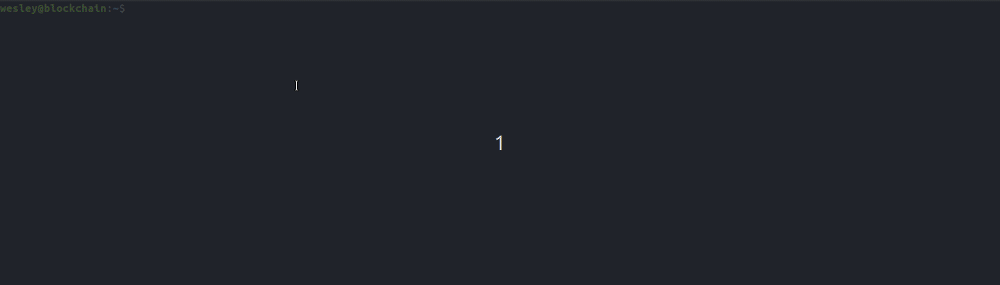

# Blockchain-block

> [Readme in English](README.md)

> [Readme in Portuguese](README_PT-BR.md)

### Description
The "Blockchain-block" is a demonstration of an important item of a blockchain, the block itself.

This project demonstrates the basic structure of a block, without considering the integration to other blocks and possible functionalities necessary for the operation of a blockchain.

Considering the basic structure, there are the following items:
- id (block identification number)
- nonce (number responsible for the hash variation in the mining process and validation of operations),
- data (Data present in the block)
- hash: concatenated content of the block applied to the hash function of the sha256 algorithm

### The process
The process of mining and validating operations is done by searching for a hash that starts with a certain amount of the number zero, in case this demonstration was defined that there must be 4 zeros at the beginning of the hash.

The variation of the hash is performed through the nonce number from which it is incremented resulting in the variation of the final hash. The existing information is concatenated and the hash function of the sha256 algorithm such as sha256(id nonce data) is applied, demonstrating the process.

### Demo

