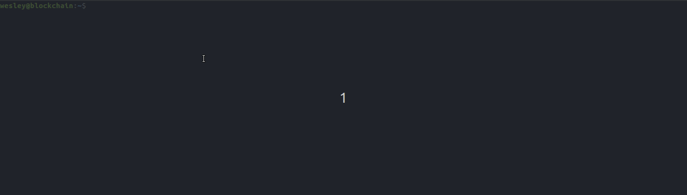

# Blockchain-block

> [Readme in English](README.md)

> [Readme em Português](README_PT-BR.md)

### Descrição
Blockchain block é uma retratação e demonstração de um dos importantes itens de uma blockchain, o bloco em si.

Neste projeto é demonstrado a estrutura básica de um bloco, sem considerar a integração a outros blocos e eventuais funcionalidades necessárias para o funcionamento de uma blockchain. 

Considerando a estrutura básica, há os seguintes itens:
- id (número de identificação do bloco)
- nonce (número responsável pela variação do hash no processo de mineração e validação de operações),
- dados (Dados presentes no bloco)
- hash: conteúdo concatenado do bloco aplicado a função de hash do algorítimo sha256

### O processo
O processo de mineração e validação de operações é realizado através da busca por um hash do qual inicie com uma determinada quantia do número zero, no caso desta demonstração foi definido que deve haver 4 zeros no início do hash.

A variação do hash é realizada através do número nonce do qual é incrementado resultando assim na variação do hash final. As informações existentes são concatenadas e é aplicado a função hash do algorítimo sha256 tal como sha256(id nonce dados)

### Demo

